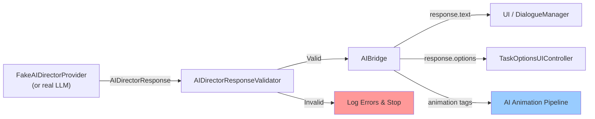
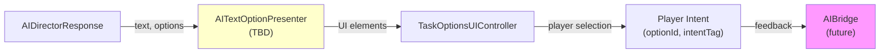

# AI Director System Architecture

## Overview

The AI Director system is an MVP layer that allows AI to influence game responses and character animation without direct control over gameplay. AI outputs structured responses (text, options, animation tags, emotion tags, camera/rhythm hints) that gameplay systems interpret and apply.

**Key Principle:** AI never controls Unity directly. AIBridge is the sole communication point between AI and gameplay.

---

## System Components

### Class Responsibility Table

| Class | Location | Responsibility |
|-------|----------|-----------------|
| **AIBridge** | `Assets/Scripts/AI/Bridge/` | Central mediator; orchestrates AI request, validation, and animation execution |
| **IAIDirectorProvider** | `Assets/Scripts/AI/Providers/` | Interface for AI response sources (fake or real LLM) |
| **FakeAIDirectorProvider** | `Assets/Scripts/AI/Providers/` | MVP provider; returns hardcoded valid responses for testing |
| **AIDirectorResponse** | `Assets/Scripts/AI/` | DTO containing text, options, emotion, animation/camera/rhythm tags, duration |
| **AIDirectorResponseValidator** | `Assets/Scripts/AI/Validation/` | Validates response against tag database; collects all errors |
| **AIPlayerOptionDto** | `Assets/Scripts/AI/` | Player choice option: id, label, buttonText, intentTag |
| **AITagDatabase** | `Assets/Scripts/AI/Tags/` | Hardcoded allowed tags (animation, emotion, camera, rhythm) |
| **AIAnimationSelector** | `Assets/Scripts/AI/Animation/` | Selects best animation definition from requested tags using scoring |
| **AIAnimationDictionary** | `Assets/Scripts/AI/Animation/` | Hardcoded animation definitions (id, stateName, trigger, float params, tags) |
| **AIAnimationDefinition** | `Assets/Scripts/AI/Animation/` | Animation mapping: tags → trigger/state/float params |
| **AIAnimatorFloatParameter** | `Assets/Scripts/AI/Animation/` | Float parameter name/value pair for Animator |
| **AIAnimationExecutor** | `Assets/Scripts/AI/Animation/` | Applies selected animation via CharacterAnimationService (trigger + floats or CrossFadeBase) |
| **CharacterAnimationService** | `Assets/Scripts/Helpers/` | Safe Animator wrapper; methods: CrossFadeBase, TrySetTrigger, TrySetFloat |

---

## Data Flows

### 1. AI Response Flow



### 2. Animation Execution Flow

```mermaid
graph LR
    A["AIDirectorResponse<br/>.AnimationTags"] -->|string[]| B["AIAnimationSelector"]
    B -->|SelectBest| C["AIAnimationDictionary<br/>(hardcoded defs)"]
    C -->|AIAnimationDefinition| D["AIAnimationExecutor"]
    D -->|TrySetFloat| E["CharacterAnimationService"]
    D -->|TrySetTrigger| E
    D -->|CrossFadeBase| E
    E -->|Animator methods| F["Animator<br/>(triggers, states, params)"]
    style B fill:#99ff99
    style C fill:#ffcc99
    style D fill:#ff99cc
    style E fill:#ccccff
```

### 3. Text & Player Options Flow



---

## Key Rules

1. **AI Never Controls Unity Directly**
   - No direct Animator parameter sets.
   - No direct scene changes.
   - No direct gameplay state changes.

2. **AIBridge is the Sole Communication Point**
   - All AI outputs pass through AIBridge.RequestAndApply().
   - Gameplay systems query AIBridge for intent, not the provider directly.

3. **Gameplay Authority is Preserved**
   - StateController, TaskManager, TaskRunner, BaseTaskController, TaskControllers remain the sole gameplay decision-makers.
   - AI influences through structured responses that gameplay interprets.

4. **Animation Selection is Tag-Based**
   - AI returns animation tags (e.g., "hand_job", "slow_controlled").
   - AIAnimationSelector matches tags to definitions.
   - Animator trigger/state is never exposed to AI.

5. **Validation is Mandatory**
   - All responses are validated against AITagDatabase before use.
   - Validation collects all errors (not fail-fast).
   - Invalid responses are logged and rejected.

---

## Current Implementation Status

### Implemented ✓
- AIBridge (MVP)
- FakeAIDirectorProvider (testing)
- AIDirectorResponse & validation
- AIAnimationSelector & dictionary
- AIAnimationExecutor
- CharacterAnimationService.TrySetTrigger / TrySetFloat
- Basic animation tag pipeline (idle, come_close, hand_job variants, end_routine)

### In Progress (Future)
- Real LLM integration (replace FakeAIDirectorProvider)
- Camera system integration (response.CameraTag)
- Emotion system integration (response.EmotionTag)
- Rhythm system integration (response.RhythmTag)
- Player option UI presenter
- Memory / context system
- JSON loading for definitions (instead of hardcoded)

### Not Implemented
- Async LLM calls
- Networking
- Animation playback (gameplay responsibility)
- Dialogue UI (gameplay responsibility)
- Memory management

---

## Next Planned Steps

### Phase 1: Core Integration
1. [ ] Create AITextOptionPresenter for displaying response text and options
2. [ ] Hook TaskOptionsUIController to listen for player selections
3. [ ] Pass player intent (optionId, intentTag) back to AIBridge for logging/future memory

### Phase 2: Extended Support
4. [ ] Add CameraTag handling in gameplay camera system
5. [ ] Add EmotionTag handling in character facial/voice system
6. [ ] Add RhythmTag handling in audio sync system

### Phase 3: LLM Integration
7. [ ] Replace FakeAIDirectorProvider with real LLM provider (OpenAI, Claude, etc.)
8. [ ] Implement async request handling
9. [ ] Add memory / context system to track conversation history

### Phase 4: Polish
10. [ ] Load animation/tag definitions from JSON instead of hardcoded
11. [ ] Add more animation definitions and tags
12. [ ] Add fallback behaviors for unmatched tags

---

## File Structure

```
Assets/Scripts/AI/
├── AIDirectorResponse.cs
├── AIDirectorValidationResult.cs
├── AIPlayerOptionDto.cs
│
├── Bridge/
│   └── AIBridge.cs
│
├── Providers/
│   ├── IAIDirectorProvider.cs
│   └── FakeAIDirectorProvider.cs
│
├── Validation/
│   └── AIDirectorResponseValidator.cs
│
├── Tags/
│   ├── AITagDefinition.cs
│   └── AITagDatabase.cs
│
├── Animation/
│   ├── AIAnimatorFloatParameter.cs
│   ├── AIAnimationDefinition.cs
│   ├── AIAnimationDictionary.cs
│   ├── AIAnimationSelector.cs
│   └── AIAnimationExecutor.cs
│
└── Debug/
    ├── AIDirectorValidatorDebugTester.cs
    ├── AIAnimationSelectorDebugTester.cs
    └── AIAnimationExecutorDebugTester.cs
```

---

## Quick Start

1. **Attach AIBridge to a GameObject:**
   - Set `Run On Start` to true.
   - Assign an `AIAnimationExecutor` reference.

2. **Attach AIAnimationExecutor to a GameObject:**
   - Assign the `CharacterAnimationService` reference.

3. **Run the scene:**
   - AIBridge will call FakeAIDirectorProvider, validate, and trigger animation.
   - Check console for debug logs.

---

## Notes

- **No JSON loading yet:** All tag and animation definitions are hardcoded for MVP simplicity.
- **No async yet:** All calls are synchronous; LLM integration will require async/await.
- **No networking:** All systems are local; future networking layer can wrap IAIDirectorProvider.
- **English only:** All code, comments, and identifiers are in English.

